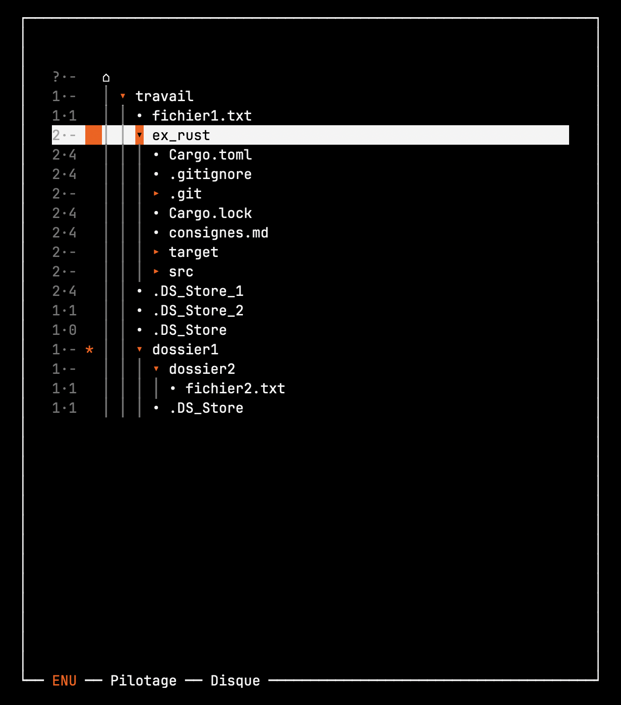

# Feu — guide utilisateur

> **Date :** 5 septembre 2026
> **Version :** v0.0.7

Ce guide vous emmène de l'installation au premier dépôt-retrait complet. Il ne
dit pas tout, juste de quoi commencer sans se perdre.

## 1. Ce que fait Feu

Feu stocke et organise vos données de manière sécurisée et versionnée, avec des
primitives cryptographiques post-quantiques.

Il travaille dans trois espaces distincts, et tout l'usage consiste à passer de
l'un à l'autre.

**Les blobs** — vos données, chiffrées en permanence, rangées à plat dans les
classeurs et nommées par leur seule empreinte : aucun nom, aucune date, aucun
ordre. On ne déchiffre qu'au moment précis où on en a besoin.

**Les enveloppes** — l'espace ENU, la pierre angulaire de Feu. C'est là qu'est
le sens : ce qui est un fichier, ce qui est un dossier, comment tout s'emboîte,
avec les noms et les tags. En clair et signées, donc consultables foyers fermés,
et vérifiables sans être cachées. Un dossier n'y cite que des empreintes, et
deux peuvent citer la même : ce n'est pas tout à fait une arborescence mais un
**DAG** — un graphe orienté sans cycle, une donnée à plusieurs endroits sans
jamais être dupliquée. Et **rien n'est jamais écrasé** — une enveloppe ne se
modifie pas, elle est remplacée, l'ancienne reste atteignable.

**Les comptoirs** — la frontière. Un dossier ordinaire, à l'endroit du disque
que vous choisissez, où les données passent en clair le temps d'être déposées ou
reprises. Ce qui s'y trouve n'est plus protégé par Feu mais par votre système de
fichiers seul : ouvrir un comptoir, c'est accepter cette responsabilité.

## 2. La structure

Un nœud possède **trois foyers**, chacun contenant **cinq classeurs**. Les
foyers sont indépendants : vous les ouvrez et les fermez comme vous voulez, l'un
sans l'autre. Ouvrir un foyer ne déchiffre aucun blob — ils restent chiffrés un
par un dans leurs classeurs. Ce que l'ouverture donne, c'est le droit d'y
toucher : lire un contenu, en déposer un nouveau, signer. L'arborescence, elle,
se parcourt foyers fermés. À la fermeture, le foyer entier est archivé en un
seul fichier, lui-même chiffré : il n'en reste qu'un `.feu` sur le disque.

## 3. Installation

```sh
git clone https://git.clavelier.me/bertrand/feu.git
cd feu
cargo build --release
cargo run --release -p feu-tui
```

Prérequis : Rust ≥ 1.98, Linux ou macOS. Aucune autre dépendance. Chaque
`cargo run` ouvre sur l'écran de pilotage, nœud éteint.

**Une seule instance de Feu à la fois.** Une seconde démarre, mais refuse
d'allumer le nœud tant que la première le tient.

Feu écrit tout dans `~/.feu/` — clés, archives de foyers, enveloppes — et
nulle part ailleurs. Sur votre système, il n'existe que ce dossier et le binaire
compilé : aucun fichier de configuration, aucun service, aucune écriture hors
de là. Supprimer `~/.feu/` remet Feu à zéro.

## 4. Les trois écrans

L'interface tient sur trois écrans, en onglets dans la bordure basse du cadre :

| gauche | milieu | droite |
|---|---|---|
| **ENU** | **Pilotage** | **Disque** |

`l` avance d'un écran vers la droite, `h` revient vers la gauche. C'est une
ligne, pas une boucle : arrivé au bout, la touche ne déplace plus rien. L'onglet
actif est en couleur.

Les trois écrans jouent des rôles complémentaires :

- **l'écran ENU** sert à choisir l'enveloppe sur laquelle agir ;
- **l'écran disque** sert à choisir le chemin où Feu lira ou écrira ;
- **le pilotage** est l'endroit où l'on déclenche, avec ces deux choix en main.

## 5. Détail de chaque écran

### Pilotage — le cœur

Les touches, selon l'endroit et l'état :

```
?  !  a  e  o  f  S  d  c  T  r  q  0–9  Backspace
```

<br>

<p align="center">
  
</p>

<br>

En haut du cadre, une ligne de **pastilles** dit l'état sans qu'on ait rien à
demander. À gauche, celle du nœud : `●` allumé, `○` éteint. À droite, une
pastille par foyer, dans l'ordre des numéros — `●` pour un foyer ouvert, `○`
pour un foyer fermé. Les pastilles allumées sont en couleur. C'est là qu'on
vérifie, avant de quitter, qu'il ne reste rien d'ouvert.

Sur la capture : nœud allumé, foyer 0 fermé, foyers 1 et 2 ouverts. L'invite
`feu/foy.2/cla.4 ›` dit où l'on se trouve — dans le classeur 4 du foyer 2.
En dessous, les trois lignes d'état : les comptoirs ouverts
(`Dépôts › 0.{f2.c4}`), l'ENU marquée (`ENU › doc`) et le chemin marqué
(`Chemin › …`). La première porte `Comptoir travail › …` quand c'est lui qui est
ouvert. Les onglets sont sur la bordure basse, l'actif en couleur.

**`?` d'abord.** Il liste les touches réellement actives ici et maintenant :
elles dépendent de l'état du nœud, du foyer où vous êtes, et des marques
posées. Une touche absente de cette liste ne fait rien.

Ce que fait chaque touche :

- **`a`** allume le nœud. La toute première fois, Feu génère une seed de 24 mots,
  l'affiche — notez-la, elle seule permet de tout retrouver — puis vous fait
  définir un mot de passe. Ensuite, `a` ne demande plus que ce mot de passe.
- **`o`** ouvre un foyer (`0`, `1` ou `2`), mot de passe à l'appui. Rien ne se
  dépose sans un foyer ouvert : c'est lui qui signe.
- **`0`–`2` puis `0`–`4`** vous positionnent dans un foyer puis dans un
  classeur ; `Backspace` remonte d'un cran.
- **`d`** ouvre un comptoir de dépôt vers le classeur où vous êtes, au chemin
  marqué sur l'écran du disque : c'est là que le dossier sera créé.
- **`c`** ferme un comptoir de dépôt et range son contenu sous l'ENU marquée,
  qui doit être un répertoire.
- **`T`** ouvre le comptoir de travail sur le répertoire marqué, au chemin
  marqué : le dossier `travail_feu` y reçoit son arborescence en clair, à
  modifier comme vous voulez. `T` de nouveau referme : le dossier fait autorité,
  Feu en reconstruit le sous-arbre puis l'efface. Un seul à la fois, et jamais
  avec un comptoir de dépôt ouvert — dépôt et travail sont deux voies exclusives.
  La racine du nœud est refusée : marquez un répertoire en dessous d'elle.
- **`r`** sort une copie en clair de l'ENU marquée : un dossier apparaît sous le
  chemin marqué et reçoit toute son arborescence, fichiers déchiffrés compris.
  Feu s'en désintéresse ensuite — rien de ce que vous y changez ne revient dans
  les enveloppes.
- **`f`, `e`, `q`** referment le foyer, éteignent le nœud, quittent — dans cet
  ordre. `S` répare un foyer resté ouvert après un arrêt brutal.

### Arborescence des ENU — vos données

C'est ici que se parcourt le DAG des enveloppes, et qu'on choisit celle sur
laquelle agir. Les enveloppes se lisent foyers fermés — mais **le nœud doit
être allumé** pour les charger.

- `R` charge l'arbre, et le recharge ensuite.
- `j` / `k` descendent et remontent, `Entrée` ouvre ou referme un dossier.
- `m` marque l'ENU sous le curseur, `x` efface la marque.

<br>

<p align="center">
  
</p>

<br>

En tête de chaque ligne, une colonne fixe situe l'enveloppe : `2·4` la place au
classeur 4 du foyer 2. Un `-` en seconde place dit qu'il n'y a pas de blob — un
répertoire — ou que le foyer est fermé ; un `?` en première une braise qui ne
désigne aucun foyer, comme celle de la racine, tout en haut de l'arbre.

Vient ensuite un symbole qui dit ce qu'est la ligne : `⌂` la racine du nœud,
`▾` un répertoire déplié, `▸` un répertoire replié, `▻` un répertoire vide, `•`
une donnée, `≡` un texte. Les traits verticaux relient chaque entrée à son
parent, un par niveau de profondeur.

La ligne surlignée est le curseur, ici sur `ex_rust` ; l'astérisque est la
marque, posée sur `dossier1`. `.git`, `target` et `src` sont des répertoires
repliés : `Entrée` les ouvrirait.

**Rien ne se met à jour tout seul, et c'est voulu** : parcourir l'arbre coûte,
et Feu ne le refait pas dans votre dos. Après la fermeture d'un comptoir de
dépôt, l'arbre affiché est d'ailleurs vidé — il vient de changer. `R` le
remonte.

La marque posée ici est reprise sur l'écran de pilotage, où elle se consomme.

### Arborescence du disque — vos chemins

Votre système de fichiers, depuis le dossier personnel. Mêmes gestes :

- `R` recharge la branche sous le curseur.
- `j` / `k` descendent et remontent, `Entrée` ouvre ou referme un dossier.
- `m` marque le chemin sous le curseur, `x` efface la marque.

Là non plus, rien ne se rafraîchit seul : Feu ne surveille pas le disque.

La marque posée ici est reprise sur l'écran de pilotage, où elle se consomme.

## 6. Exemple de parcours : ouverture et fermeture d'un comptoir de dépôt

Écran par écran, avec ce que vous verrez.

1. **Pilotage** — `a`, puis `o` et `0`.
2. **Disque** (`l`) — `j`/`k` et `Entrée` jusqu'au dossier d'accueil, puis `m`.
3. **Pilotage** (`h`) — `0` pour entrer dans le foyer, `0` pour le classeur,
   puis `d`. Un dossier `f0.c0_depot_feu` apparaît dans votre chemin marqué :
   copiez-y les fichiers à déposer. La ligne `Dépôts › 0.{f0.c0}` s'affiche.
4. **ENU** (`h`) — `R` pour charger l'arbre, `m` sur la racine.
5. **Pilotage** (`l`) — `c`, puis le numéro du comptoir (`0`). Feu lit le
   dossier, chiffre chaque fichier, l'enveloppe et le greffe sous la marque.
6. **ENU** — l'arbre a été vidé, il vient de changer : `R` le recharge, `m` sur
   le répertoire à ressortir.
7. **Pilotage** — `r`. Un dossier `retrait_feu_` suivi de huit caractères
   apparaît dans votre chemin marqué et reçoit l'arborescence en clair.
8. **Pilotage** — `f`, `e`, `q`.

## 7. Ce qui peut surprendre

- **Tout est numéroté à partir de zéro** : les foyers vont de `0` à `2`, les
  classeurs de `0` à `4`, et le premier comptoir ouvert porte le numéro `0`.
  C'est l'indice interne du système, montré tel quel plutôt que décalé pour
  l'affichage.
- **Le mot de passe est redemandé à chaque ouverture de foyer.** Feu ne le
  garde pas en mémoire entre deux opérations.
- **Le nœud doit être allumé pour charger les ENU**, même si les enveloppes
  sont lisibles foyers fermés.
- **Ne quittez jamais Feu brutalement avec un foyer ouvert** — Ctrl-C, fenêtre
  fermée, machine éteinte. Vos données ne sont pas exposées pour autant : les
  blobs restent chiffrés, un par un, comme toujours. Mais le foyer resterait
  déployé au lieu d'être archivé et rechiffré, et Feu ne saurait plus le
  rouvrir : c'est le seul état incorrect qu'il puisse atteindre. Si cela arrive,
  rien de grave : relancez, allumez le nœud et utilisez `S`, la fermeture de
  secours prévue pour ce cas.
- **La sortie propre est `f`, puis `e`, puis `q`.** `e` n'apparaît que tous
  foyers fermés, et `q` que nœud éteint.
- **Sous-arbre incomplet** : si un foyer signataire du sous-arbre est fermé, `r`
  et `T` échouent en le nommant. Ouvrez-le, retentez.
- **Ne touchez pas à l'arborescence de `~/.feu/`** à la main. Pour repartir sur
  une base neuve, supprimez le dossier entier et relancez : Feu recommence à
  zéro, nouvelle seed comprise.
- **C'est une version de test.** N'y rangez aucune donnée à laquelle vous
  tenez.
